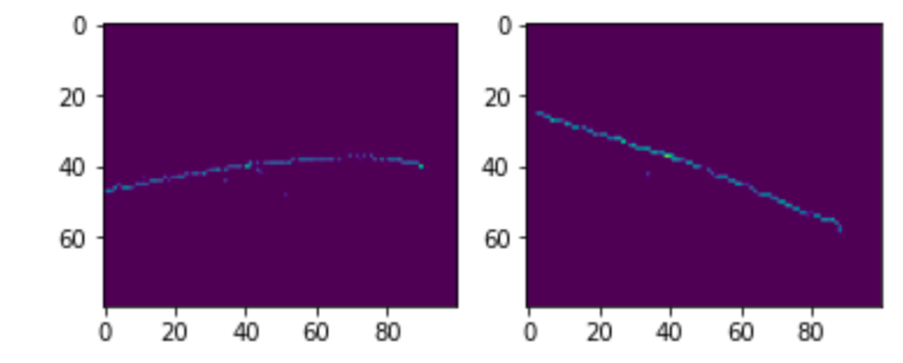
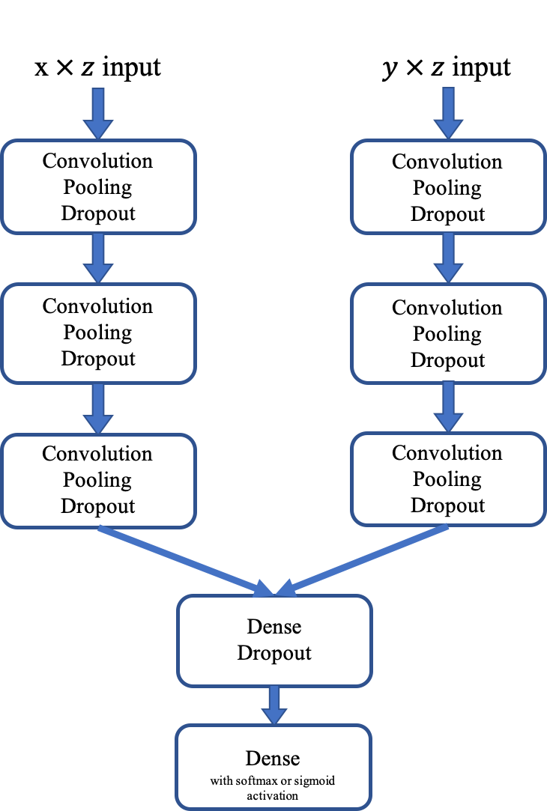

# Dual Input CNN Neutrino Classifier

In this project, I create a CNN image classifier for neutrino interactions within a simulated NoVA-like detector. You can read the full report for this work [here](https://github.com/imanfs/neutrino/blob/main/report.pdf). 

The variation in the probability of measuring a neutrino’s flavour as it propagates through space is called neutrino oscillation, and NoVA’s primary goal was to detect $\nu_{\mu}$ to $\nu_{e}$ oscillation. Each event in the simulated dataset has two images, corresponding to the $x \times z$ and $y \times z$ projections of the tracks of particles in the detector:

 

I created several dual-input convolutional neural network classifiers to classify these interactions as well as regression models to predict metavariables such as particle energy. This code was written using Google Colab with a GPU, and you can use [this link](https://colab.research.google.com/drive/1u1ehI2L8-SA7FQMfymn6mgtScpc8IH9m?usp=sharing) to access and run the code on Colab or run `neutrino_classifier.py` directly from the terminal. 

## **Inspecting the dataset**

The first thing I want to do before starting this project is analyse the quality of the data. A model can't adequately predict underlying patterns unless the data it is trained on is of good quality, meaning preferably thousands of training examples, and the data is not biased toward certain variables. 
I would like to clarify that the proportions of different variables are more or less the same for all the data files, even though below I only analyse this on one file. 

### Unskewing the data

I compared the number of CC muon neutrino events versus the number of non-CC events, and found that there is a huge bias towards charged current events and that they make up the majority of the events in the data files, roughly 87% of all data. This means that while training the model, the data was skewed towards muon neutrino events. 

To offset this, I have created data arrays filled with a roughly equal number of CC and non-CC events, with corresponding labels, and have trained my model on that set. I did this by creating two sets of image and data arrays (one for $\nu_\mu$ CC events and one for non $\nu_\mu$ CC events) and then eliminated the excess events/labels from the array with the 1s, a process called undersampling. Then I appended the 1 and 0 label arrays and the 1 and 0 image arrays, and shuffled them using `sklearn.utils.shuffle` function, so the data would be randomly distributed without disrupting the mapping. 

In the Task 4 training data, the electron neutrinos only made up a maximum of 2% of events while muon neutrinos made up a whopping 98% of all interactions. Undersampling was employed again in the same manner as above. 

I also noted that DIS events make up over half of the data, while QE events are only ~12%.

## $\nu_\mu$ event classifier

I decided to make a binary classifier to identify $\nu_\mu$ events, with the label 1 corresponding to a $\nu_\mu$ event and a 0 corresponding to other events. In the above section, I discussed how $\nu_{\mu}$ events make up 87% of the dataset and how I used a preprocessing method called downsampling to rebalance the data.

### First step: Extracting data

I created a function to extract data from the HDF5 files called `train_extractor`. To make my code more efficient and to lessen the number of necessary functions, within this function I appended the necessary maps and labels needed for training every model, as opposed to repeating this for each task. The tasks were numbered from 1-4 and depending on the task, different values were appended to the image/label arrays.

### Model Architecture

The Keras Functional API was used to create a dual-input CNN. A function was made called `feature_extractor()` which contains the three convolutional, pooling and dropout layers:

 

I noticed that my network performed far better (80%+ accuracy) when I increased the number of filters layer by layer, as opposed to the standard way of building a CNN where the first layer has the most nodes (75% max accuracy). 

## **Network optimisation**

### 1. Hyperparameters 

#### Optimiser, metric, loss

As this is a binary classifier, the binarycrossentropy loss and binary_accuracy were employed. The optimiser 'adam' was used throughout.

#### Batch size:

The batch size was chosen as 256 as the data points are in the hundreds of thousands, so processing more data in each epoch was deemed more efficient. 

#### Kernel stride:

A kernel stride of (2,2) produced lower accuracy on both training/validation and on the test data than the default stride of (1,1), so it was kept to the default. 

#### Callbacks:

If the validation loss did not become lower by a threshold value for 5 epochs, training was stopped to limit overtraining. 

### 2. Parameters

The number of parameters was kept lower than the data points. It was noted that whenever the number of parameters was ~1,000-2,000 less than the number of data points, the training/validation accuracy shot up significantly. I thought this signified overfitting however this number of parameters consistently produced higher testing success.

### Testing the model

The model was tested on a randomly chosen file; the accuracy rarely went above 80%, the loss rarely lower than 0.33. The success of the model was hard to gauge, as the same exact model run twice on the same data had a test accuracy that varied sometimes by 4-5%. For this reason I created a loop (below) to run and test the model 10 times and obtain the average test accuracy.

### Model success

I would say this model definitely is partially successful. Ideally, a really good model would reach 90%+, but the training/validation graph definitely shows the model is indeed learning, however the lower accuracy might be linked to the quality of the data, as opposed to the model efficiency. This will be explored in task 2. 

## Testing model efficiency dependence on meta variables

Below, I created 6 sub-testing sets to compare 3 metedata categories: 

1.   QE vs DIS events
2.   High lepton energy vs low lepton energy
3.   High neutrino energy vs low neutrino energy

### Creating test sets

I did not create a test set for RES events as I wanted to compare two ends of the spectrum (QE vs DIS). As for comparing $E_{\nu}$ values, I noticed that over 50% of the data had energy values of 16 GeV or less. To create a roughly fair split of "high" and "low" energy values, and as the highest energy was ~80 GeV, I decided to make the lower 50% of the data "low" and the other half of the data (> 16 GeV) in the "high" category. This means that the values that were 1/5 of the maximum energy value were in the low group. I did the same thing for the $E_{\ell}$ categories, where the threshold for high values was 3.8 GeV.

### Analysis

#### QE vs. DIS events
The QE events set had much higher accuracies over several runs (87%-91%) vs DIS (63%-70%). DIS events make up over half of the dataset compared to QE which makes up only ~12% so it makes sense that the overall accuracy of the model on an unprocessed test file is closer to the DIS accuracy range.  

#### High vs low neutrino energy

There was no significant difference in model performance for this variable. This is possibly due to the neutrino's characteristic low mass and therefore low impact on interactions, meaning the images would remain largely unaffected by the neutrino energy. 

#### High vs low lepton energy

There was a significant difference in how the model performed for these two categories (high lepton energy was always at least 10% higher), possibly due to the fact that leptons are some of the heavier particles within these collisions (relative to neutrinos) so they can affect the interactions within the simulator. The model performed better on high lepton energy events, and as with the QE vs DIS events there is a much lower incidence of these events in the dataset, hence the lower overall accuracy. 

## Neutrino energy algorithm

A regression model was created to find values for $\nu$ energies. 

## $\nu$ flavour classifier

As was seen previously, there are no $\nu_\tau$ events in any of the data files. For my model, I did not consider interactions of type "other" to be a flavour catergory; this means that once again it will be easier to create a binary classifier to differentiate between $\nu_\mu$ and $\nu_e$ events.

#### Skewed data

As with the first task, the data is also heavily skewed with electron neutrino events making up 2% of the dataset. The same downsampling process was applied to this data, too. 

## **Task 5:** $y = E_{\ell} /E_{\nu}$ algorithm

A regression model was created to find values for the ratio of neutrino and lepton energies. 
In this dataset, any data points with $E_{\nu} = 0$ were discarded to avoid dividing by 0.

## Interaction mode classifier

The model's performance was very poor, possibly due to plenty of NC interactions or insufficient data. The model definitely learned, however it is very unlikely that it would produce any meaningful results on any test data, given the final accuracy of ~40%
